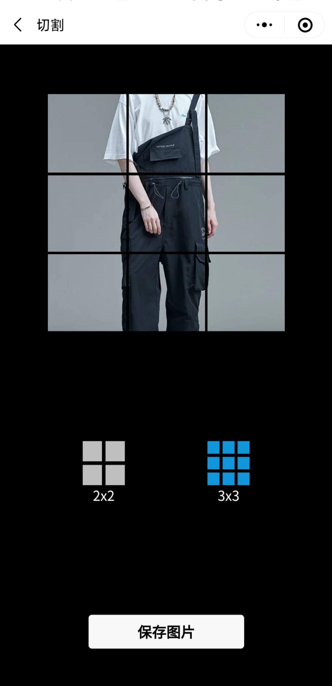

<h1 align="center">EqualCutPicture</h1>

<div align="center">

将一张图片等份切割成四宫格、九宫格小图保存。


</div>

## 🧐 使用

```bash
git clone https://github.com/wangladi/equal-cut-picture.git
```

Copyright (c) 2021 Ma Sha